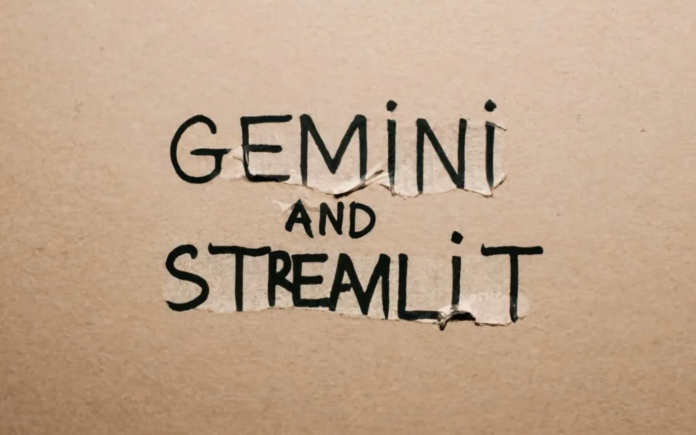
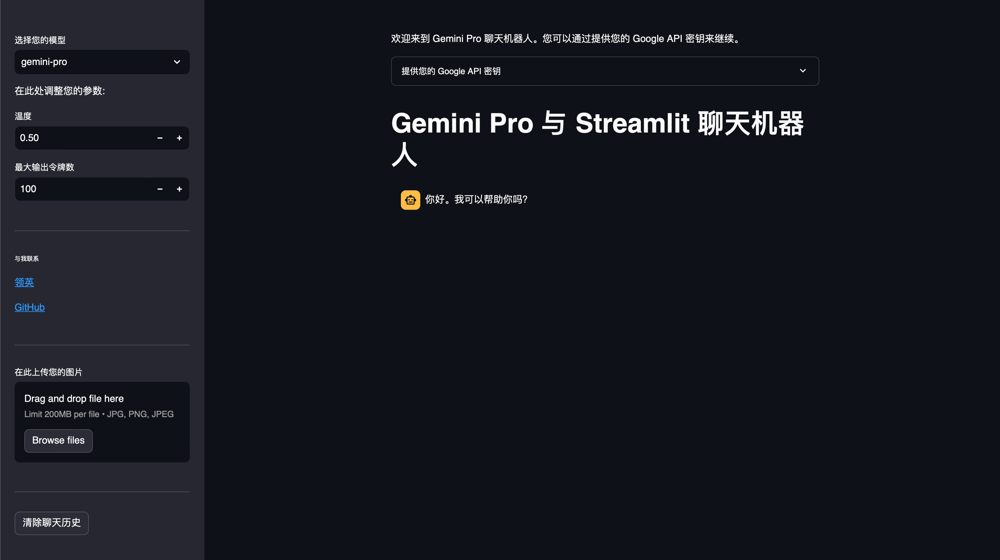

# 使用 Gemini Pro 和 Streamlit 开发多模式 LLM 聊天机器人

上次发布了一篇文章 **初学者指南：如何开始使用 Google Gemini API** 有需要的小伙伴可以点击下面的链接

https://www.toutiao.com/article/7314866009620365836/

今天，我们将详细讲解，如何使用 Gemini Pro 和 Streamlit 创建一个简单的多模态聊天机器人。

## Gemini API

我们先熟悉下 Gemini API，了解模型 API 的主要用法和如何获得输出。

### 安装 Google 开发包

```bash
pip install google-generativeai
```

安装 Google  的生成式 AI（Generative AI）库，用来访问 Gemini API。建议这里可以创建一个虚拟环境。

### 配置 Google API 密钥

你可以访问 Google Makersuite（https://makersuite.google.com/） 创建密钥：

为了简单起见，我们通过把密钥传递到 **`.configure`** 函数中来配置 API 密钥。

```python
import google.generativeai as genai
genai.configure(api_key=GOOGLE_API_KEY)
```

### 测试文生文

我们会用到下面的个模型：

- gemini-pro：仅用于文本提示的模型。
- gemini-pro-vision：文本和图像的多模态模型。

用 gemini-pro 模型测试文生文，我们在代码中直接提问，代码如下。

```python
model = genai.GenerativeModel('gemini-pro')
response = model.generate_content("眼睛的用途是什么？")

print(response.text)

```

### 测试图生文

下面是使用 gemini-pro-vision 模型测试图生文，调用接口生成文本响应。示例中，我们使用文章封面中第一张图片。

```python
img = Image.open('image.jpg')

model = genai.GenerativeModel('gemini-pro-vision')
response = model.generate_content(img)

print(response.text)

```

### 测试文本和图片组合输入

这里用 gemini-pro-vision 模型

```python
img = Image.open('image.jpg')

model = genai.GenerativeModel('gemini-pro-vision')
prompt = "这张图像的颜色是什么，文本的颜色是什么？"
response = model.generate_content([prompt, img])

print(response.text)

```

### 测试聊天功能

首先需要启动聊天会话类来管理会话。

```python
pythonCopy code
model = genai.GenerativeModel('gemini-pro')
chat = model.start_chat(history=[])

```

然后，使用以下代码完成整个对话。

```python
model = genai.GenerativeModel('gemini-pro')
chat = model.start_chat(history=[])

response = chat.send_message("眼睛的用途是什么？", stream=True)
response.resolve()
print(response.text)

response = chat.send_message("总结前面的段落给我一句话", stream=True)
response.resolve()
print(response.text)

print(chat.history)

```

需要主要，要通过调用 **`.resolve`** 函数让模型完成处理，完成一次对话。此外，把 **`stream`** 参数设置为 **`true`**，以流式传输聊天。以下图像是上述对话的聊天历史。

这里提醒一下**，gemini-pro-vision 模型是不支持多轮对话功能的。**

### 调整模型参数

我们使用模型中的 **`generation_config`** 参数来调整模型参数。这里我们运行修改最大 token 输出和温度参数。

```python
response = model.generate_content('眼睛的用途是什么？',
generation_config=genai.types.GenerationConfig(max_output_tokens=50,
temperature=0.5))

```

## 使用 Streamlit 构建 LLM 应用

教程的其余部分是关于如何结构化和组合 Streamlit 组件与 Gemini API 模型。

### 安装 streamlit 安装包

如果你还没有安装该包，可以使用以下代码。

```bash
pip install streamlit
```

### 配置执行规则

这里我们要求只有设置了 Google API 密钥，才可以进行聊天

```python
import streamlit as st
from PIL import Image
import google.generativeai as genai

st.set_page_config(page_title="Gemini Pro with Streamlit", page_icon="♊")

st.write("欢迎来到 Gemini Pro 聊天机器人。您可以通过提供您的 Google API 密钥来继续")

with st.expander("提供您的 Google API 密钥"):
    google_api_key = st.text_input("Google API 密钥", key="google_api_key", type="password")

if not google_api_key:
    st.info("输入 Google API 密钥以继续")
    st.stop()

genai.configure(api_key=google_api_key)

```

### 启动聊天机器人命令

将上述代码放在 **`home.py`** 文件中，并通过以下代码在 CLI 中启动应用。

```bash
streamlit run home.py
```

## 代码整合

我们将上面的代码整合到 [home.py](http://home.py) 文件。整个代码如下所示。

```python
st.title("Gemini Pro with Streamlit 聊天机器人")

with st.sidebar:
    option = st.selectbox('选择您的模型', ('gemini-pro', 'gemini-pro-vision'))

    if 'model' not in st.session_state or st.session_state.model != option:
        st.session_state.chat = genai.GenerativeModel(option).start_chat(history=[])
        st.session_state.model = option

    st.write("在此处调整参数：")
    temperature = st.number_input("温度", min_value=0.0, max_value=1.0, value=0.5, step=0.01)
    max_token = st.number_input("最大输出 token", min_value=0, value=100)
    gen_config = genai.types.GenerationConfig(max_output_tokens=max_token, temperature=temperature)

    st.divider()

    st.markdown("<span ><font size=1>联系我</font></span>", unsafe_allow_html=True)
    "[Linkedin](https://www.linkedin.com/in/cornellius-yudha-wijaya/)"
    "[GitHub](https://github.com/cornelliusyudhawijaya)"

    st.divider()

    upload_image = st.file_uploader("在此上传您的图像", accept_multiple_files=False, type=['jpg', 'png'])

    if upload_image:
        image = Image.open(upload_image)

    st.divider()

    if st.button("清除聊天历史"):
        st.session_state.messages.clear()

```

通过添加上述代码，你的 Streamlit 聊天机器人看起来像这样。

我们继续讲解上面整合的代码，

### 设置模型选择框

将模型选择和对象存储在 **`st.session_state`** 中，保持会话。

```python
option = st.selectbox('选择您的模型', ('gemini-pro', 'gemini-pro-vision'))

if 'model' not in st.session_state or st.session_state.model != option:
    st.session_state.chat = genai.GenerativeModel(option).start_chat(history=[])
    st.session_state.model = option

```

### 模型参数设置

用过 GPT 小伙伴都清楚，这个用来微调输出结果

```python
st.write("在此处调整参数：")
temperature = st.number_input("温度", min_value=0.0, max_value=1.0, value=0.5, step=0.01)
max_token = st.number_input("最大输出 token", min_value=0, value=100)
gen_config = genai.types.GenerationConfig(max_output_tokens=max_token, temperature=temperature)
```

### 初始化多模态任务

由于我们想要使用 Gemini Pro Vision 模型进行多模态，我们需要初始化上传图像数据的选项。

```python
upload_image = st.file_uploader("在此上传您的图像", accept_multiple_files=False, type=['jpg', 'png'])

if upload_image:
    image = Image.open(upload_image)
```

### 重置聊天对话框

重置时，会清除聊天历史和开场对话。

```python
if st.button("清除聊天历史"):
     st.session_state.messages.clear()
     st.session_state["messages"] = [{"role": "assistant", "content": "你好。我可以帮你吗？"}]
```

接下来，我们将聊天对话程序引入到 Streamlit 中。

```python
if "messages" not in st.session_state:
    st.session_state["messages"] = [{"role": "assistant", "content": "你好。我可以帮你吗？"}]

for msg in st.session_state.messages:
    st.chat_message(msg["role"]).write(msg["content"])

if upload_image:
    if option == "gemini-pro":
        st.info("请切换到 Gemini Pro Vision")
        st.stop()
    if prompt := st.chat_input():
            st.session_state.messages.append({"role": "user", "content": prompt})
            st.chat_message("user").write(prompt)
            response=st.session_state.chat.send_message([prompt,image],stream=True,generation_config = gen_config)
            response.resolve()
            msg=response.text

            st.session_state.chat = genai.GenerativeModel(option).start_chat(history=[])
            st.session_state.messages.append({"role": "assistant", "content": msg})

            st.image(image,width=300)
            st.chat_message("assistant").write(msg)

else:
    if prompt := st.chat_input():

            st.session_state.messages.append({"role": "user", "content": prompt})
            st.chat_message("user").write(prompt)

            response=st.session_state.chat.send_message(prompt,stream=True,generation_config = gen_config)
            response.resolve()
            msg=response.text
            st.session_state.messages.append({"role": "assistant", "content": msg})
            st.chat_message("assistant").write(msg)

```

以上是我们使用 Streamlit 和 Gemini Pro 创建的整体结构。

接下来是讲解 Streamlit 在项目中的应用

## Streamlit 在项目中的应用

### 保持会话纪录

这一部分，我们设置了会话状态来存储所有对话。同时，上述代码会初始化第一次聊天，并随后保持未来聊天的历史记录。

```python
if "messages" not in st.session_state:
    st.session_state["messages"] = [{"role": "assistant", "content": "你好。我可以帮你吗？"}]

for msg in st.session_state.messages:
    st.chat_message(msg["role"]).write(msg["content"])

```

### 输入场景设置

这里要做判断，图片上传必须要使用 Gemini Pro Vision 模型才能正常使用

```python
if upload_image:
    if option == "gemini-pro":
        st.info("请切换到 Gemini Pro Vision")
        st.stop()
    if prompt := st.chat_input():
            st.session_state.messages.append({"role": "user", "content": prompt})
            st.chat_message("user").write(prompt)
            response=st.session_state.chat.send_message([prompt,image],stream=True,generation_config = gen_config)
            response.resolve()
            msg=response.text

            st.session_state.chat = genai.GenerativeModel(option).start_chat(history=[])
            st.session_state.messages.append({"role": "assistant", "content": msg})

            st.image(image,width=300)
            st.chat_message("assistant").write(msg)

```

我们给上面的代码一个条件，只有当模型是 Gemini Pro Vision 时才会运行，因为如果我们提供图像输入，Gemini Pro 模型会抛出错误。

另外文本输入场景，则必须使用 Gemini Pro  模型，因为 Gemini Pro Vision 模型不能进行多轮对话。在文本对话中，我们会将输入的信息保持在 prompt 变量中，以便后续的对话使用。

对于 Gemini Pro 模型，代码如下。

```python
else:
    if prompt := st.chat_input():

            st.session_state.messages.append({"role": "user", "content": prompt})
            st.chat_message("user").write(prompt)

            response=st.session_state.chat.send_message(prompt,stream=True,generation_config = gen_config)
            response.resolve()
            msg=response.text
            st.session_state.messages.append({"role": "assistant", "content": msg})
            st.chat_message("assistant").write(msg)

```

以上是所有的代码，下面是演示的截图


**参考地址**：
- [初学者指南：如何开始使用 Google Gemini API](https://www.toutiao.com/article/7314866009620365836/)
- [Gemini Pro 介绍](https://blog.google/technology/ai/gemini-api-developers-cloud/)
- [Google API 密钥](https://makersuite.google.com/)
- [Streamlit 文档](https://docs.streamlit.io/)